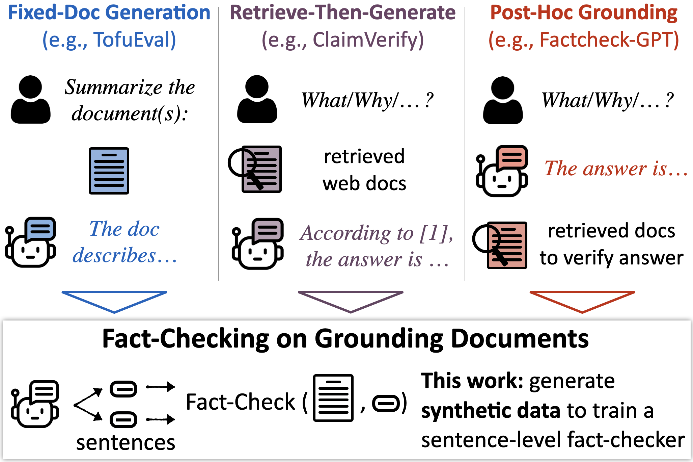

# MiniCheck: Efficient Fact-Checking of LLMs on Grounding Documents

Authors: Liyan Tang, Philippe Laban, Greg Durrett

Please check out our work [here]() 📃

<p align="center">
    
</p>


## *LLM-AggreFact* Benchmark

### Description

LLM-AggreFact is a fact verification benchmark by aggregating 10 of the most up-to-date publicly available datasets on factual consistency evaluation across both closed-book and grounded generation settings. In LLM-AggreFact:
1. Documents come from diverse sources, including Wikipedia paragraphs, interviews, web text, covering domains such as news, dialogue, science, and healthcare.
2. Claims to be verified are mostly generated from recent generative models (except for one dataset of human-written claims), *without any human intervention in any format, such as injecting certain error types into model-generated claims*.

### Benchmark Access

Our Benchmark is available on HuggingFace 🤗 More benchmark details can be found [here](https://huggingface.co/datasets/lytang/LLM-AggreFact).

```python
from datasets import load_dataset
dataset = load_dataset("lytang/LLM-AggreFact")
```

The benchmark contains the following fields:

|Field| Description |
|--|--|
|dataset| One of the 10 datastes in the benchmark|
|doc| Document used to check the corresponding claim|
|claim| Claim to be checked by the corresponding document|
|label| 1 if the claim can be supported by the doc, 0 otherwise|


## *MiniCheck* Models

Available soon.


## Synthetic Data Generation 

Available soon.