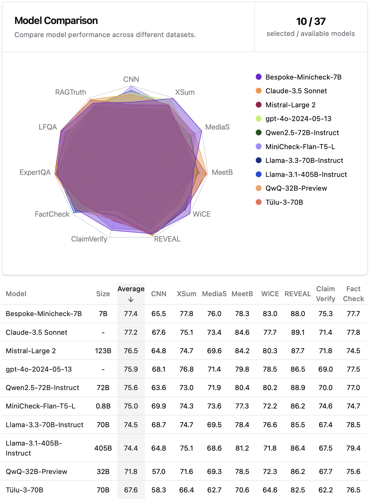

# MiniCheck: Efficient Fact-Checking of LLMs on Grounding Documents [EMNLP 2024]

Authors: Liyan Tang, Philippe Laban, Greg Durrett

Please check out our work [here](https://arxiv.org/pdf/2404.10774.pdf) 📃

<p align="center">
    
</p>


*Updates* 🔥

- [2024/09] MiniCheck is now [available](https://ollama.com/library/bespoke-minicheck) at [ollama](https://ollama.com). You can now run MiniCheck locally on your laptop 💻 with a simple command! More info in the ollama [blog post](https://ollama.com/blog/reduce-hallucinations-with-bespoke-minicheck) and [tweet](https://x.com/ollama/status/1836449420092821731?s=61).

- [2024/09] MiniCheck is now available as a [validator](https://hub.guardrailsai.com) at [Guardrails AI](https://www.guardrailsai.com).

- [2024/08] A notebook for using MiniCheck is available [](https://colab.research.google.com/drive/1s-5TYnGV3kGFMLp798r5N-FXPD8lt2dm?usp=sharing)

- [2024/08] We release the [LLM-AggreFact leaderboard](https://llm-aggrefact.github.io), which currently contains the performance of 32 models on the LLM-AggreFact benchmark, including Qwen-2.5, Llama-3.2, Llama-3.1, Mistral Large 2 and Claude-3.5.

- [2024/08] We includ one additional dataset [RAGTruth](https://arxiv.org/pdf/2401.00396) to our benchmark. We convert the dataset to the same format as in our benchmark and removed those non-checkworthy claims. 

- [2024/08] We developed a stronger model, `Bespoke-MiniCheck-7B`, which is now [available](https://huggingface.co/bespokelabs/Bespoke-MiniCheck-7B) on HuggingFace for fact-checking. More details at this [blog post](https://llm-aggrefact.github.io/blog). It's the current SOTA and is commercially useable! Please contact company@bespokelabs.ai for commercial use.

- [2024/08] We enable [automic prefix caching](https://docs.vllm.ai/en/latest/automatic_prefix_caching/apc.html) for much faster inference when repeatedly using the same document for fact-checking.

- [2024/08] [Demo](https://playground.bespokelabs.ai) of `Bespoke-MiniCheck-7B` with **real-time** inference!


## *LLM-AggreFact* Benchmark

### Description

LLM-AggreFact is a fact verification benchmark. It aggregates 11 of the most up-to-date publicly available datasets on factual consistency evaluation across both closed-book and grounded generation settings. In LLM-AggreFact:
1. Documents come from diverse sources, including Wikipedia paragraphs, interviews, web text, covering domains such as news, dialogue, science, and healthcare.
2. Claims to be verified are mostly generated from recent generative models (except for one dataset of human-written claims), *without any human intervention in any format, such as injecting certain error types into model-generated claims*.

### Benchmark Access

Our Benchmark is available on HuggingFace 🤗 More benchmark details can be found [here](https://huggingface.co/datasets/lytang/LLM-AggreFact).

```python
from datasets import load_dataset
dataset = load_dataset("lytang/LLM-AggreFact")
```

The benchmark contains the following fields:

|Field| Description |
|--|--|
|dataset| One of the 11 datasets in the benchmark|
|doc| Document used to check the corresponding claim|
|claim| Claim to be checked by the corresponding document|
|label| 1 if the claim is supported, 0 otherwise|
|contamination_identifier| An identification string for contamination detection |

## *MiniCheck* Model Evaluation Demo

<p align="center">
 
</p>

### Installation

The following command will install the **MiniCheck package** and all necessary dependencies.

```sh
pip install "minicheck @ git+https://github.com/Liyan06/MiniCheck.git@main"
```

or with optional vllm dependency for inference of LLM-based MiniCheck model `Bespoke-MiniCheck-7B` (Linux only)

```sh
pip install "minicheck[llm] @ git+https://github.com/Liyan06/MiniCheck.git@main"
```

### Usage

Our MiniCheck models are available on HuggingFace 🤗 More model details can be found from this [collection](https://huggingface.co/collections/lytang/minicheck-and-llm-aggrefact-661c5d387082ad0b433dec65). 


> [!IMPORTANT]
> MiniCheck(document, sentence) -> [0, 1] is a sentence-level fact-checking model. In order to fact-check a multi-sentence claim, the claim should first be broken up into sentences to achieve optimal performance. 


Below is a simple use case of MiniCheck. MiniCheck models will be automatically downloaded from Huggingface for the first time and cached in the specified directory.


```python
from minicheck.minicheck import MiniCheck
import os
os.environ["CUDA_VISIBLE_DEVICES"] = "0"

doc = "A group of students gather in the school library to study for their upcoming final exams."
claim_1 = "The students are preparing for an examination."
claim_2 = "The students are on vacation."

# model_name can be one of the followings:
# ['roberta-large', 'deberta-v3-large', 'flan-t5-large', 'Bespoke-MiniCheck-7B']

#  MiniCheck-Flan-T5-Large (770M) is the best fack-checking model 
# with size < 1B and reaches GPT-4 performance.
scorer = MiniCheck(model_name='flan-t5-large', cache_dir='./ckpts')
pred_label, raw_prob, _, _ = scorer.score(docs=[doc, doc], claims=[claim_1, claim_2])

print(pred_label) # [1, 0]
print(raw_prob)   # [0.9805923700332642, 0.007121330592781305]


# Alternatively, you can use our Bespoke-MiniCheck-7B model (7B) for evaluation. 
# Bespoke-MiniCheck-7B is the most performant fact-checking model 
# in the MiniCheck series AND is the current SOTA regardless of size.
# It's also commercially useable! 
# For commercial licensing, please contact company@bespokelabs.ai
scorer = MiniCheck(model_name='Bespoke-MiniCheck-7B', enable_prefix_caching=False, cache_dir='./ckpts')
pred_label, raw_prob, _, _ = scorer.score(docs=[doc, doc], claims=[claim_1, claim_2])

print(pred_label) # [1, 0]
print(raw_prob)   # [0.9840446675150499, 0.010986349594852094]
```

A detailed walkthrough of the evaluation process on LLM-Aggrefact and replication of the results is available in this notebook: [benchmark_evaluation_demo.ipynb](./benchmark_evaluation_demo.ipynb).

## Automatic Prefix Caching ([More Info](https://docs.vllm.ai/en/latest/automatic_prefix_caching/apc.html))

> Automatic Prefix Caching (APC in short) caches the KV cache of existing queries, so that a new query can directly reuse the KV cache if it shares the same prefix with one of the existing queries, allowing the new query to skip the computation of the shared part.

If you use the same document to fact-check different claims, APC allows vLLM to process the document only once, and all future claims can avoid recomputing this document by reusing its KV cache. This allows vLLM to serve future grounded fact-checking with much higher throughput and much lower latency.

To enable automatic prefix caching for `Bespoke-MiniCheck-7B`, simply set `enable_prefix_caching=True` when initializing the MiniCheck model (no other changes are needed).:

```python
scorer = MiniCheck(model_name='Bespoke-MiniCheck-7B', enable_prefix_caching=True, cache_dir='./ckpts')
```

### Throughput

For some datasets in LLM-AggreFact, the grounded documents are repeatedly used, such as TofuEval-MediaS/MeetB, LFQA, and RAGTruth. Hence, we test the throughput of MiniCheck before and after APC is enabled. Results show that the inference time on the 29K test set is 30 mins and 55 mins with and without APC enabled, respectively, on a single NVIDIA A6000 (48 GB VRAM).

### Performance

We compare the benchmark performance of `Bespoke-MiniCheck-7B` with APC enabled (top) and disabled (bottom).  Performance varies slightly across different datasets, but the overall average is the same. Please decide whether to enable APC based on your specific use case.

<p align="center">
    
</p>


## Synthetic Data Generation 

Code for generating synthetic data (both C2D and D2C methods) is available in the [`synthetic_data_gen`](./synthetic_data_gen) directory.
Our 14K synthetic data (7K C2D and 7K D2C) used for model training (MiniCheck-RoBERTa/DeBERTA/Flan-T5) is available on HuggingFace 🤗 and can be found [here](https://huggingface.co/datasets/lytang/C2D-and-D2C-MiniCheck).


## Citation

If you found our work useful, please consider citing our work.
```{bibtex}
@InProceedings{tang-etal-2024-minicheck,
  title = {MiniCheck: Efficient Fact-Checking of LLMs on Grounding Documents},
  author = {Liyan Tang and Philippe Laban and Greg Durrett},
  booktitle = {Proceedings of the 2024 Conference on Empirical Methods in Natural Language Processing},
  year = {2024},
  publisher = {Association for Computational Linguistics},
  url = {https://arxiv.org/pdf/2404.10774}
}
```