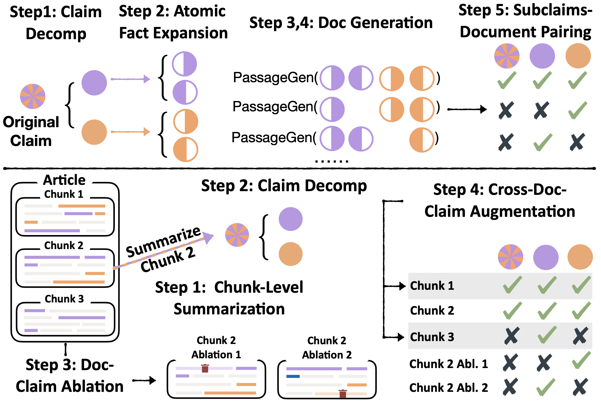

## Synthetic Data Generation

<p align="center">
    
</p>

This directory contains code for generating synthetic training data for the C2D and D2C method. The goal of this data generation is to create data that requires multi-sentence, multi-fact reasoning to check claims against documents.

**Please add your `OPENAI_API_KEY`** in the `synthetic_data_gen/prompt_utils.py` file to use the OpenAI API for generating synthetic data.

### C2D Data Generation

We start with any human-written claim statement. The goal is to generate synthetic documents that require models be able to check multiple facts in the claim against multiple sentences each.

We provide the C2D code for generating (doc, claim, label) triples for a given claim. We use the claim mentioned in our work *"By this date, over 5,000 members of the caravan were staying at the Tijuana Stadium — a structure with a capacity of 3,000."* as an example:
```
cd synthetic_data_gen
python C2D_gen.py --claim "By this date, over 5,000 members of the caravan were staying at the Tijuana Stadium — a structure with a capacity of 3,000."
```


### D2C Data Generation

We start with any human-written documents to start with. The goal is to generate claims and pair them with portions of the human written document, which, once again, require multi-sentence, multi-fact reasoning to check the claims. **We assume the document length is around 500 words. Longer documents would make the data generation more costly in general due to the "leave-one-sent-out" document augmentation method.**

We provide the D2C code for generating (doc, claim, label) triples for a given document. We use the document mentioned in our work as an example. The original website for the document can be found [here](https://www.indiewire.com/news/box-office/strikes-over-damage-theatrical-box-office-1234925398/).
```
cd synthetic_data_gen
python D2C_gen.py --doc_path D2C-doc-example.txt
```


## Citation

If you found our work useful, please consider citing our work.
```{bibtex}
@misc{tang2024minicheck,
      title={MiniCheck: Efficient Fact-Checking of LLMs on Grounding Documents}, 
      author={Liyan Tang and Philippe Laban and Greg Durrett},
      year={2024},
      eprint={2404.10774},
      archivePrefix={arXiv},
      primaryClass={cs.CL}
}
```